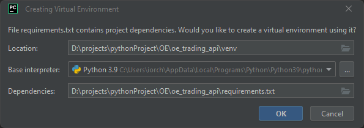

# Pricing API

---
## Project Set-up

### Clone from GitHub the Project

```
    https://github.com/Oepfelbaum/oe_trading_api.git
```

### Configure Interpreter


### From Terminal execute the following command line:

```
    python.exe -m pip install --upgrade pip
    
    python -m venv venv
    
    .\venv\Scripts\activate
    
    pip install -r requirements.txt
```

### Configure .env file

* Contact OE Cloud Admin Team to request the following Azure env variables.
* Create a .env with the following variables:
* **TODO -> Move them to the Azure Vault**

```
    TENANT_ID=XXX
    SERVER_API_ID=XXX
    OPENAPI_CLIENT_ID=XXX
    CLIENT_ID=XXX
    CLIENT_SECRET=XXX
```

### Test your application

```
    python -m app.main
```

### Run unit test

```
    python -m pytest app/tests
```

### Run unit test with coverage

```
    coverage run -m pytest 
```

---
## Docker

### Prerequisites

* If you have already installed dockers review for upgrades to have the latest version.
* If you have to install dockers, go to: https://oepfelbaum.atlassian.net/wiki/spaces/TR/pages/3305177143/Set-up+Docker

### Create docker image and deploy container locally

To build an image with name oe/oe_trading_api 

```
    docker build . -t oe/oe_trading_api
```

Running container with name oe_trading_api

```
    docker run -d --name oe_trading_api -p 8000:8000 oe/oe_trading_api 
```

Stopping the container

```
    docker stop oe_trading_api
```

Removing the container

```
    docker rm oe_trading_api
```

### Using script to create docker image and deploy container locally

The following file automates the manual process described above.

```
    run docker_deploy_localy.bat
```

### Push image to Azure and deploy container locally

* This script creates a local image
* Tag and push the image in Azure Container Repository
* And deploy the image locally

#### Prerequisites: 

* To log in to Azure you will require an Azure Principal.
* How-to use an Azure principal from local, go to: https://oepfelbaum.atlassian.net/wiki/spaces/TR/pages/3326869506/Create+Principal+to+Push+Docker+Images
* To login to Azure -> https://oepfelbaum.atlassian.net/wiki/spaces/TR/pages/3326607386/Publish+a+Docker+Image+into+Azure+from+Local

```
    run docker_azure_image.bat
```

### Manually docker pull remote image from Azure to deploy test it locally

Example using the repository id **60ffe99fb481a4dc99759af0626da79a616bd18d**

```
    docker pull oeappsregistry.azurecr.io/oe_trading_api:60ffe99fb481a4dc99759af0626da79a616bd18d
```

Running container using image pulled before

```
    docker run -d --name oe_trading_api -p 8000:8000 oeappsregistry.azurecr.io/oe_trading_api:60ffe99fb481a4dc99759af0626da79a616bd18d
```
